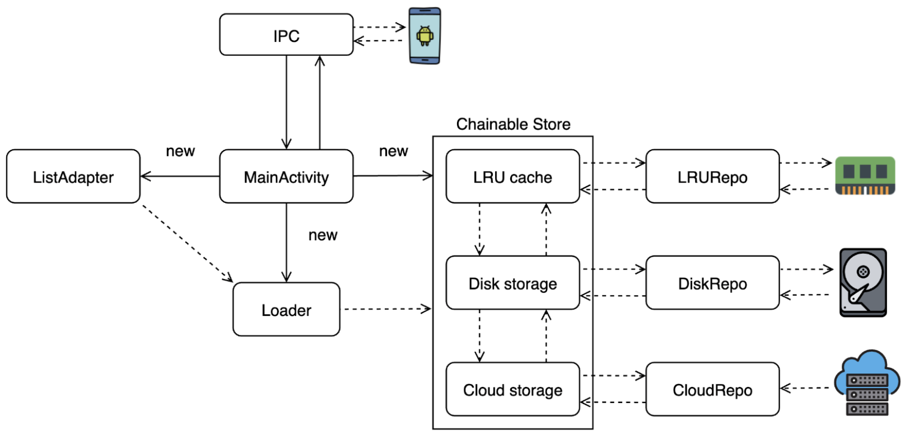
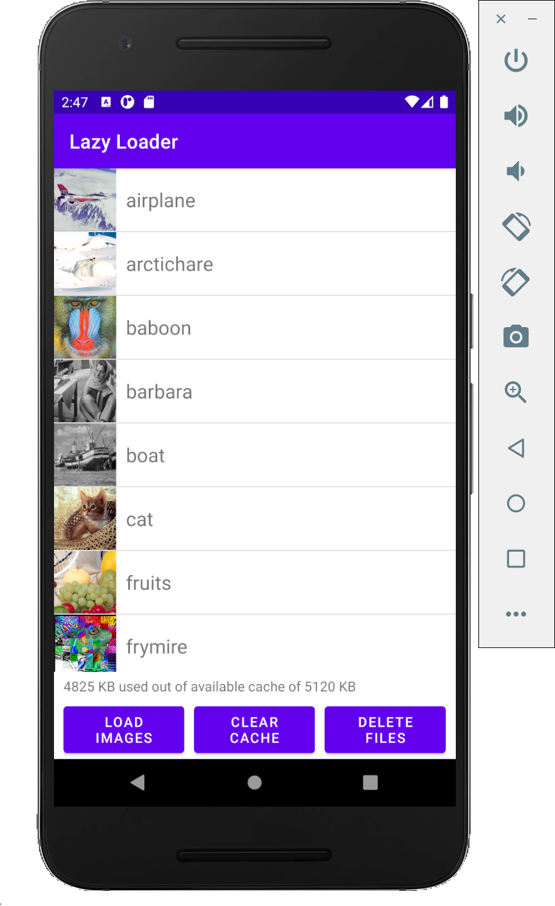

# CS205-Assignment-3: Lazy Loader

  
  

## Description

Lazy loading is a commonly implemented optimization technique that defers the initialization of non-critical resources and attempts to load them only when needed. When implemented properly, this can help to improve performance and reduce the use of system resources.

In this project, we are creating a simple Android application that displays a scrollable list of images with text. Instead of retrieving every image from the web, we have also implemented a multi-level storage and caching solution. 

Whenever an image has to be loaded, the application will first attempt to retrieve it from an LRU cache if it exists. Otherwise, the application will try to retrieve it from disk, and finally download it from the web if it is not stored in the disk either. The cache and disk will also save the data for images that have been requested by the user before, so as to reduce loading times for those images in the future.

## Usage & Requirements

Android Studio must be installed in order to run the application locally. After cloning the repository on Github, simply open it as a project on Android Studio. It is also possible to build the application into a .apk file, which can then be installed and run on any Android device.

## Documentation

View our [documentation](docs/design_considerations.pdf).