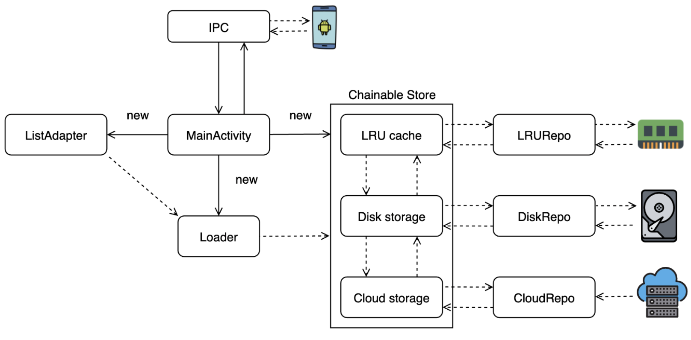
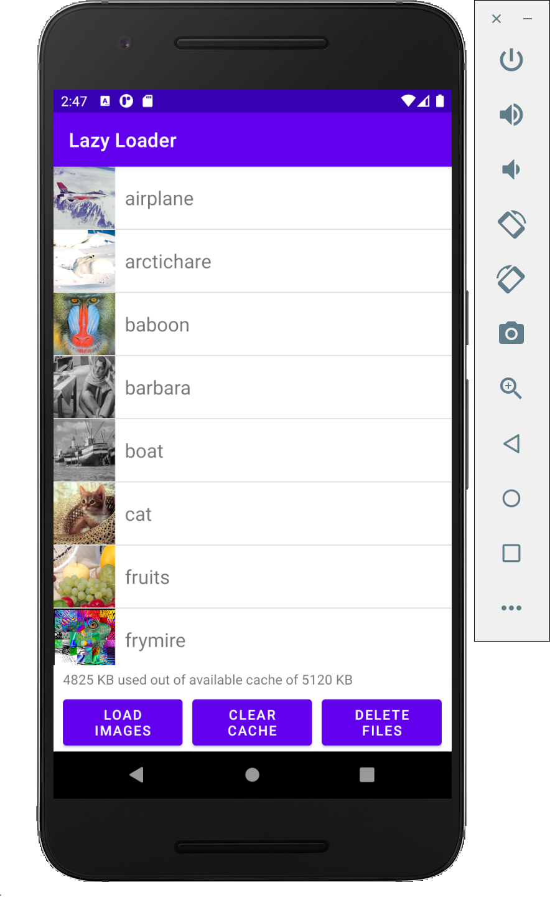
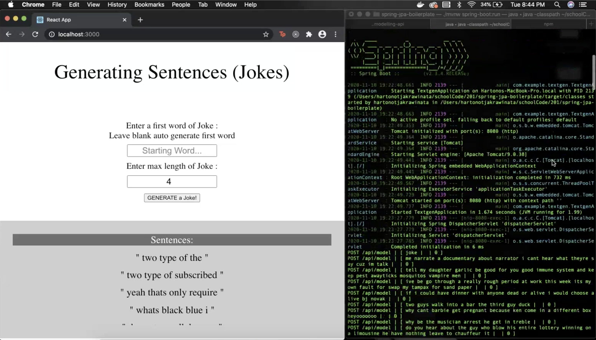
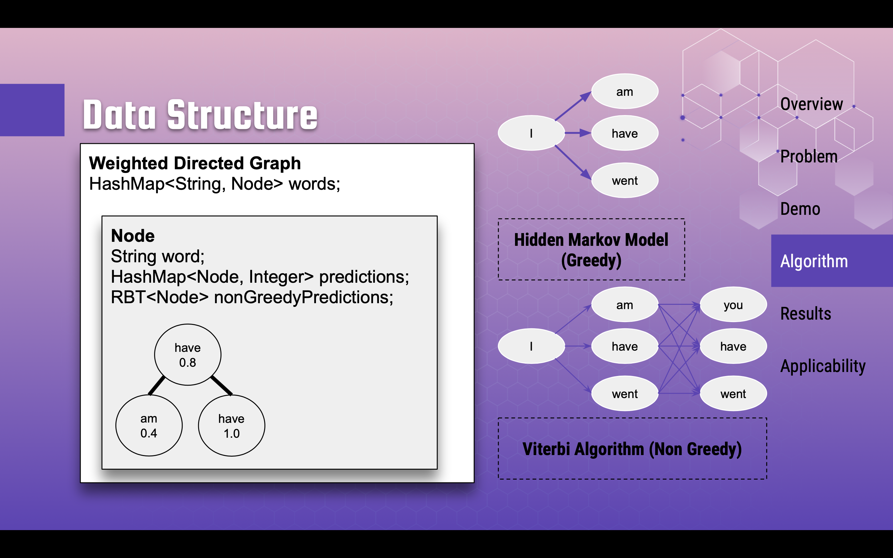

# smu_cs_projects

  
  
  
  
  

### Favorite Projects
- [CS206: Mobile QR code hawker center ordering platform (Jiak)](./206_software_product_management/platform_patron)
- [CS420: Heuritic Search, Astar search, MDP, RL, NLP](./420_artificial_intelligence/code_assignment_2)
- [CS205: Cacheing in Android - Multi level cache for lazy loading of list of content](./205_operating_systems/assignment_3)

### Modules & my Projects
- CS102 Object Oriented Programming
  - [Project: Social media & Farming game](./102_oop/final_project)
    - Javac compiled API & Tomcat Server
- CS105 Data Science and Statistics
  - [Project: Wine quality based on chemical properties](./105_data_science/wine-quality-jupyter)
    - Multiple Linear Regression and Cross Validation
- CS201 Data Structures
  - [Project: Joke Generator](./201_data_structures/final_project)
    - Graphs & Viterbi Algorithm
    - Platform: React & Springboot frameworks
- CS202 Algorithms
  - [Assignment 1: Huffman's code, Djikstra, Algorithmic Analysis](./202_algorithms/assignment_1)
  - [Assignment 2: Iterative Dynamic Programming](./202_algorithms/assignment_2)
- CS203 Spring Development
  - [Project: Banking Platform - credit suisse](./203_spring_development/final_project)
    - OAuth, https certificates, trading environment, account & portfolio management
    - Platform: Spring Server hosted on AWS
- CS204 Networking
  - [Assignment: TCP/IP with python](./204_networking/assignment_01339300)
- CS205 Operating System
  - [Assignment 1: Process Scheduler - creating, prioritising, & terminating processes](./205_operating_systems/assignment_1)
  - [Assignment 2: Cacheing in Android - Multi level cache for lazy loading of list of content](./205_operating_systems/assignment_3)
- CS206 Software Product Management
  - [Project: Mobile QR code hawker center ordering platform (Jiak)](./206_software_product_management/platform_patron)
    - Platform: React, Node, MongoDB, AWS
    - 2 sided application
      - platform_patron (patron facing frontend)
      - platform_hawker (hawker facing frontend)
      - backend (NodeJS, MongoDB)
- CS420 Artificial Intelligence
  - [Assignment 1: Bayesian Networks, ANN, CNN](./420_artificial_intelligence/assignment_1.pdf)
  - [Assignment 2: Heuritic Search, Astar search, MDP, RL, NLP](./420_artificial_intelligence/code_assignment_2)

